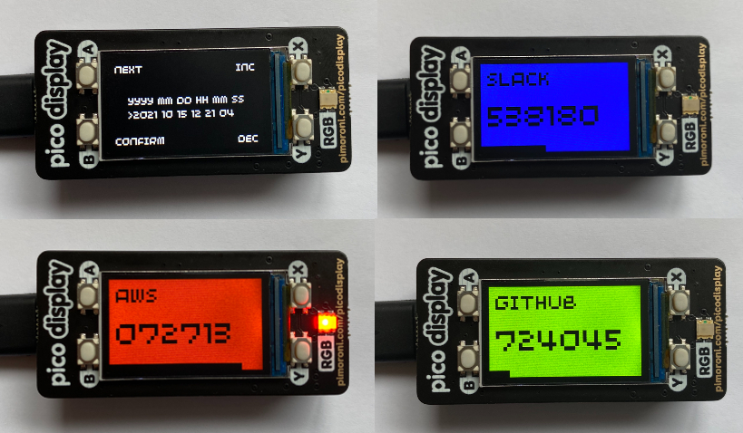

# Raspberry Pi Pico/MicroPython 2FA TOTP Generator

Generates Time-based One-Time Password's (TOTP) using MicroPython, Raspberry Pi Pico and the [Pico Display Pack](https://shop.pimoroni.com/products/pico-display-pack).

## Features

- Complete [MicroPython implementation](totp) of the TOTP specification (and underlying HMAC-SHA1, Base32 dependencies).
- Customisable background colours per TOTP.
- Progress bar to present how long till the TOTP is about to expire.
- Flashing alert LED when the TOTP is about to expire.
- Initial configuration screen to set the current UTC time - to correct the Raspberry Pi Pico's RTC.

## Usage

- Connect the [Pico Display Pack](https://shop.pimoroni.com/products/pico-display-pack) to the Raspberry Pi Pico.
- Create a `codes.json` file (based on `codes.json.example`) which includes the desired TOTP keys.
- Flash the Raspberry Pi Pico with the latest [MicroPython with Pimoroni Libs](https://github.com/pimoroni/pimoroni-pico/releases/latest).
- Copy the codebase to the Raspberry Pi Pico.
- Upon boot, you will be required to specify the current UTC time (clicking `B` once set).
- Now you can cycle through your TOTP's using the `X` button.

